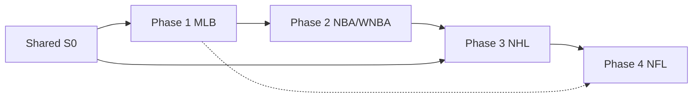

# YetAI prediction accuracy roadmap

**Status:** Approved for execution  
**Order:** MLB → NBA + WNBA → NHL → NFL  
**Ground truth for O/U grading:** FanDuel lines where available; document gaps when NULL  
**Epic bead:** `YetAI-ft6` — children `YetAI-ft6.1` … `YetAI-ft6.21` (run `bd show YetAI-ft6`)

## Goals

1. Raise measurable accuracy (MAE, O/U hit rate, Brier for win-prob) per sport with offline backtests before production promotion.
2. Move training and validation into YetAI where it is externalized (NBA props) or missing (NHL/NFL).
3. Add model versioning on predictions and CI/regression gates on artifact upload.
4. Reduce heuristic-only surfaces (MLB hits, NHL all markets, NFL QB yards).

## Non-goals (this roadmap)

- Unified `pred_*` schema across leagues (`YetAI-4sa` stays separate).
- Prophet / deep learning stacks.
- Replacing Odds API as primary line source.

## Shared foundations (parallel with Phase 1)

| ID | Work | Acceptance |
|----|------|------------|
| ACC-S0.1 | `model_version` on all new/updated prediction writes | Column populated from S3 metadata or training run id |
| ACC-S0.2 | Document promotion playbook | `docs/ML_PROMOTION.md`: backtest → holdout → S3 upload → Celery smoke |
| ACC-S0.3 | CI gate template | Reuse WNBA `validate_model.py` pattern; fail PR if MAE/Brier regresses |

**Files:** `predictions_models.py`, `accuracy_shared.py`, `.github/workflows/`

---

## Phase 1 — MLB (weeks 1–4)

MLB already has backtest, calibration, and retrain. Focus: unused features, heuristic hits, measurable lift.

### 1.1 Game model — deferred features

**Problem:** Eight computed features excluded from `FEATURE_COLS` (`game_model.py` `DEFERRED_FEATURE_COLS`).

**Tasks:**
1. Backfill quality report: % non-neutral per deferred col in training rows (`game_model_eval.py` coverage).
2. When coverage ≥ 80% for a column, add to `FEATURE_COLS` one at a time.
3. Walk-forward eval (`game_model_eval.py`) — report Brier, ML accuracy, calibration buckets vs baseline.
4. Retrain ensemble + upload calibrator to S3 if lift ≥ 0.5% Brier or 1% ML accuracy.

**Acceptance:** JSON eval in `backtest_results/` showing improvement or explicit “no lift” decision per column.

### 1.2 Game model — backtest regression in CI

**Tasks:**
1. Add pytest or CI job: `mlb_backtest.py --quick` (20 games) with max Brier/accuracy regression thresholds from checked-in baseline JSON.
2. Wire `mlb.backtest_quick` quarterly on Beat (optional).

**Acceptance:** PR fails if quick backtest metrics regress beyond tolerance.

### 1.3 Hits / 1+ hit board — ML or hybrid

**Problem:** `hits.py` uses weighted heuristic only; large UI surface.

**Tasks:**
1. Baseline: score current heuristic vs actuals in backtest scorer (extend `backtest/scorer.py`).
2. Prototype calibrated classifier: P(1+ hit) from rolling stats + pitcher matchup + park (mirror strikeout `classification_model.py`).
3. A/B in backtest: heuristic vs ML vs blend; promote if hit-rate or calibration improves.

**Acceptance:** Backtest report includes hits metrics; production path uses winning approach.

### 1.4 Strikeouts — reliability + retrain cadence

**Tasks:**
1. Soften import-time hard fail in `strikeouts.py` — degrade gracefully with admin alert if model missing.
2. Automate retrain when `joined >= MLB_STRIKEOUT_MIN_JOINED_ROWS` after weekly actuals (Celery + `ml_ops_status` check).
3. Track O/U hit rate vs FanDuel in `mlb_accuracy_service` by `model_version`.

**Acceptance:** No pipeline crash without model; retrain metrics JSON archived per run.

### 1.5 Meta-learner — prove or remove

**Tasks:**
1. Backtest compare: calibrated ensemble alone vs ensemble + `meta_learner.py` stack.
2. If no lift, document skip in `MLB_ML_OPS.md`; if lift, wire into `game_projection_pipeline.py`.

**Acceptance:** Documented decision with numbers.

### Phase 1 PR slices

| PR | Scope |
|----|--------|
| MLB-1 | Deferred feature backfill report + 1–2 cols into FEATURE_COLS |
| MLB-2 | Quick backtest CI baseline |
| MLB-3 | Hits backtest metrics + ML prototype |
| MLB-4 | Strikeout graceful degrade + retrain automation |
| MLB-5 | Meta-learner eval |

---

## Phase 2 — NBA + WNBA (weeks 5–10)

WNBA is the reference (`ml_training/`, MAE gates, spread ML). NBA infers frozen S3 pickles from YetiBets.

### 2.1 Shared ML package

**Blocks:** `YetAI-2wf` (extract WNBA ml_training)

**Tasks:**
1. Move to `app/services/ml/` (or `app/services/etl/_ml_training/`): `build_training_dataset`, `train_model`, `validate_model`, `upload_to_s3`.
2. NBA + WNBA thin wrappers pass league config (table prefixes, S3 prefix, MAE gates).

**Acceptance:** WNBA tests green; no duplicate training code.

### 2.2 NBA — in-repo prop retrain

**Tasks:**
1. Port `nba/_feature_engineering.py` contract into training dataset builder.
2. Train points/rebounds/assists (then 3PM/steals/blocks/FTM) with holdout season.
3. MAE gates (start with WNBA thresholds; tune from NBA holdout): points ≤ 5.0, assists ≤ 1.6, rebounds ≤ 2.2 (adjust after first run).
4. GitHub Action: train on schedule or `workflow_dispatch`; upload to `s3://yetibets/nba/ml_models/`.
5. Fix training-parity quirks only in same PR as retrain (steals defense column, etc.).

**Acceptance:** New `xgb_{stat}_metadata.json` includes `train_date`, `holdout_mae`; generators read `model_version`.

### 2.3 NBA — FanDuel / prop lines backfill

**Tasks:**
1. Audit which `generate_*_predictions.py` leave FanDuel NULL.
2. Wire `_fanduel_lines.py` (or Odds API player props) for all graded stats.
3. `store_actuals` O/U grading ≥ 70% of slate with non-null line.

**Acceptance:** `nba_accuracy_service` O/U buckets populated for core stats.

### 2.4 NBA — game-level ML

**Tasks:**
1. **Totals:** GBM residual model on top of `totals_projector.py` baseline OR full ML totals; evaluate vs heuristic in `totals_accuracy_tracker`.
2. **Spreads:** Port WNBA `train_spread_model.py` + `_spread_ml_predict.py` to NBA; compare Brier to Elo-only (`spreads_accuracy_tracker.py`).

**Acceptance:** Spread/totals accuracy API shows improvement over 14-day rolling baseline.

### 2.5 WNBA — complete Phase 3 props (optional in parallel)

**Existing:** `YetAI-5pi`

**Tasks:** blocks/steals/3PM/FTM/PRA after NBA training path proven.

### 2.6 NBA — prop calibration

**Tasks:**
1. For each stat, fit residual distribution on holdout → P(over line).
2. Expose in API or auto-pick only after calibration buckets are stable.

**Acceptance:** Calibration buckets |residual_mean| < 0.3 per quintile on holdout.

### Phase 2 PR slices

| PR | Scope |
|----|--------|
| BKB-1 | Shared `ml_training` package (`YetAI-2wf`) |
| BKB-2 | NBA train points + CI upload |
| BKB-3 | NBA remaining stats + line backfill |
| BKB-4 | NBA spread ML |
| BKB-5 | NBA totals ML / residual |
| BKB-6 | Prop calibration layer |

---

## Phase 3 — NHL (weeks 11–15)

All heuristic today; no backtest in YetAI.

### 3.1 Baseline backtest port

**Tasks:**
1. Port YetiBets `backtest_predictions.py` → `app/services/etl/nhl/backtest/`.
2. CLI `scripts/nhl_backtest.py` — replay historical slates vs `pred_nhl_*_actuals`.
3. Metrics: goalie saves MAE + O/U, player SOG MAE + O/U, team totals MAE + O/U.

**Acceptance:** Baseline JSON checked in; CI quick mode (subset of seasons).

### 3.2 Starter confirmation

**Tasks:**
1. Port `confirm_starters.py` into pre-prediction step in `daily_predictions.py`.
2. Skip or downgrade confidence when starter unconfirmed.

**Acceptance:** Fewer predictions for backup goalies starting cold.

### 3.3 Goalie saves ML (first model)

**Tasks:**
1. Feature matrix from `NHLGoalieActuals`, `NHLTeamStats`, opponent shots, rest, home.
2. Train XGB regressor + calibrated classifier vs saves line (Odds API).
3. Shadow mode: write `model_version` heuristic vs ml_* ; compare in backtest.

**Acceptance:** Backtest MAE ↓ ≥ 5% vs heuristic; O/U hit rate ↑ ≥ 2 pts (or documented tradeoff).

### 3.4 Player SOG + team totals ML

**Tasks:** Same pattern after goalie promotes; reuse shared `ml_training` hooks.

### 3.5 Season + config hygiene

**Tasks:**
1. `NHL_SEASON` env/config instead of hardcoded `20252026`.
2. Reduce league-average defaults where DB has team-specific stats.

**Acceptance:** Season rollover is one config change.

### Phase 3 PR slices

| PR | Scope |
|----|--------|
| NHL-1 | Backtest CLI + baseline |
| NHL-2 | Starter confirmation |
| NHL-3 | Goalie ML shadow |
| NHL-4 | Goalie ML promote + SOG ML |
| NHL-5 | Team totals ML + config |

---

## Phase 4 — NFL (weeks 16–20)

QB yards path is the weakest high-traffic prediction.

### 4.1 Week/season consolidation

**Tasks:**
1. Single `get_current_nfl_week()` in `nfl_common.py`; remove duplicates in `qb_dynamic`, `qb_betting`, `kickers`.
2. Fix `collect_kicker_actuals.py` hardcoded week hack.
3. Dynamic season from config.

**Acceptance:** `validate_nfl_pipeline.py` passes across simulated week rollover.

### 4.2 NFL backtest CLI

**Tasks:**
1. `app/services/etl/nfl/backtest/` — historical QB yards + kicker FG vs nflverse actuals and stored lines.
2. `scripts/nfl_backtest.py` — parallel to MLB.

**Acceptance:** Baseline metrics JSON; documents current tier-table accuracy.

### 4.3 QB passing yards ML

**Tasks:**
1. Port/implement `advanced_qb_predictor.py` (deferred in `NFL_ETL_PARITY.md`).
2. Features: rolling yards, opponent pass D, home, rest, injury, weather, implied team total from odds.
3. Train regression + optional O/U classifier vs `player_pass_yds` line.
4. Replace tier table in `qb_dynamic.py` behind feature flag `NFL_QB_ML_ENABLED`.

**Acceptance:** Backtest MAE beats tier baseline by ≥ 10%; production flag default off until one week shadow OK.

### 4.4 Kicker ensemble tune

**Tasks:**
1. Walk-forward blend weight for `NFL_KICKER_ML_BLEND_WEIGHT` (not fixed 0.35).
2. Distance imputation from attempt history not flat 38.0.

**Acceptance:** Backtest FG MAE improves vs current blend.

### Phase 4 PR slices

| PR | Scope |
|----|--------|
| NFL-1 | Week/season consolidation |
| NFL-2 | Backtest CLI + baseline |
| NFL-3 | QB yards ML shadow |
| NFL-4 | QB yards promote + kicker tune |

---

## Metrics dashboard (ongoing)

| Sport | Primary metrics | Source |
|-------|-----------------|--------|
| MLB | Brier (ML), K O/U %, hits %, HR rate | `mlb_accuracy_service`, backtest JSON |
| NBA/WNBA | Prop MAE, O/U %, spread Brier | `nba_accuracy_service`, `wnba_accuracy_service` |
| NHL | Goalie/SOG/totals MAE + O/U | `nhl_accuracy_service`, nhl backtest |
| NFL | QB yards MAE + O/U, kicker FG MAE | `nfl_accuracy_service`, nfl backtest |

## Dependency graph (phases)



NBA/WNBA shared training (Phase 2.1) also unblocks NHL ML training patterns (Phase 3.3).

## Session pick-up

```bash
bd ready   # unblocked work
bd show YetAI-ft6       # epic
bd ready               # first unblocked: YetAI-ft6.1 (S0) or YetAI-ft6.2 (MLB deferred features)
bd show YetAI-ft6.2    # Phase 1 start: MLB game deferred features
```

## References

- Audit conversation: 2026-05-25 prediction accuracy review
- `backend/docs/MLB_ML_OPS.md`, `MLB_ETL_PARITY.md`, `NBA_ETL_PARITY.md`, `NHL_ETL_PARITY.md`, `NFL_ETL_PARITY.md`
- WNBA gates: `app/services/etl/wnba/ml_training/validate_model.py`
